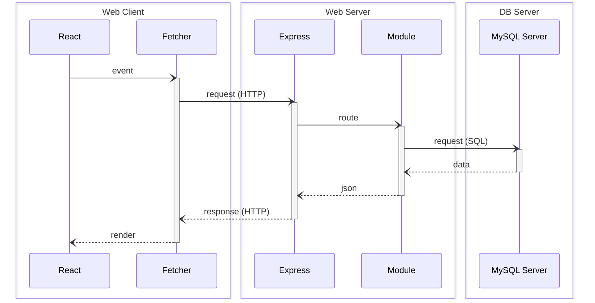

[](https://github.com/rocambille/start-express-react/tags/)
[](https://github.com/rocambille/start-express-react/blob/main/LICENSE.md)
[](https://github.com/rocambille/start-express-react/issues)

<div align="right">

[](./README.en-US.md)
[](./README.md)

</div>

<div align="center">
    
# StartER

[](https://github.com/rocambille/start-express-react/generate)

[](https://github.com/rocambille/start-express-react/wiki/Home-en-US)

</div>

This project is an educational framework, following an Express-React architecture connected to a database:



The framework comes pre-configured with a set of tools to help junior developers produce industrial-quality code, while remaining an educational tool:

- [**Express**](https://expressjs.com/): Minimalist framework for building web servers and APIs with Node.js.
- [**React**](https://react.dev/learn): JavaScript library for building interactive and modular user interfaces.

Under the hood (in alphabetical order, non-exhaustive list):

- [**Biome**](https://biomejs.dev/): All-in-one tool for linting, formatting, and static code analysis, designed to ensure code quality and readability in a powerful and modern way.
- [**Docker**](https://docs.docker.com/): Containerization platform for standardizing and automating development and deployment environments, ensuring reproducible configurations.
- [**MySQL**](https://dev.mysql.com/doc/refman/8.4/en/): Relational database management system used to store and query data.
- [**Pico CSS**](https://picocss.com/): Minimalist and lightweight CSS kit that prioritizes semantic syntax.
- [**React Router (Data Mode)**](https://reactrouter.com/home): Routing manager for React applications, allowing the creation of dynamic paths and components.
- [**TypeScript**](https://www.typescriptlang.org/): JavaScript superset that adds static types, eases maintenance, and reduces errors.
- [**Vite**](https://vite.dev/guide/): Fast and lightweight build tool for front-end applications, with a blazing-fast development server and optimized bundles for production.
- [**Vitest**](https://vitest.dev/guide/): JavaScript testing framework.
- [**Zod**](https://zod.dev/): TypeScript-based schema declaration and validation library.

## Installation and Usage

Complete documentation is available in our [wiki](https://github.com/rocambille/start-express-react/wiki/Home-en-US).

To get started, refer to the following pages:

* [Installation](https://github.com/rocambille/start-express-react/wiki/Installation-en-US)
* [Database](https://github.com/rocambille/start-express-react/wiki/Database-en-US)
* [Express](https://github.com/rocambille/start-express-react/wiki/Express-en-US)
* [React](https://github.com/rocambille/start-express-react/wiki/React-en-US)

## Things to remember

### Directory structure

```
.
├── .env
├── .env.sample
├── compose.yaml
├── compose.prod.yaml
├── Dockerfile
├── index.html
├── server.ts
└── src
    ├── database
    │   └── schema.sql
    ├── express
    │   ├── routes.ts
    │   └── modules
    │       └── ...
    ├── react
    │   ├── routes.tsx
    │   ├── components
    │   │   └── ...
    │   └── pages
    │       └── ...
    └── types
        └── index.d.ts
```

### Basic Commands

| Command | Description |
|------------------------------------------------------------------|-----------------------------------------------------------------------------|
| `docker compose up --build` | Build and start services (add `-d` to start in detached mode) |
| `docker compose -f compose.prod.yaml up --build -d` | Build and start in production mode |
| `docker compose logs -t` | Displays logs with timestamps |
| `docker compose run --build --rm server npm run database:sync` | Synchronizes database contents with `src/database/schema.sql` |
| `docker compose run --build --rm server npm run test` | Runs tests |
| `npm run biome:check` | Checks code quality with Biome (executed on pre-commit) |
| `npm run types:check` | Checks type consistency with TypeScript (executed on pre-commit) |

### REST cheatsheet

| Operation | Method | URL Path | Request Body | SQL | Response (Success) | Response (Error) |
|-----------|---------|-----------------|---------------------|---------|---------------------------------|-------------------------------------------------------------------------|
| Browse | GET | /api/items | | SELECT | 200 (OK), list of items. | |
| Read | GET | /api/items/:id | | SELECT | 200 (OK), one item. | 404 (Not Found), if invalid id. |
| Add | POST | /api/items | Item Data | INSERT | 201 (Created), insert id. | 400 (Bad Request), if invalid body. |
| Edit | PUT | /api/items/:id | Item Data | UPDATE | 204 (No Content). | 400 (Bad Request), if invalid body. 404 (Not Found), if invalid id. |
| Destroy | DELETE | /api/items/:id | | DELETE | 204 (No Content). | |
