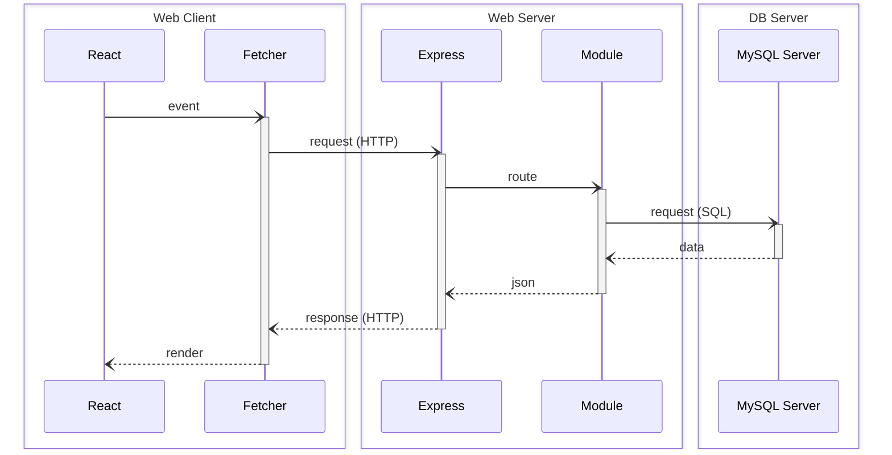

[](https://github.com/rocambille/start-express-react/tags/)
[](https://github.com/rocambille/start-express-react/blob/main/LICENSE.md)
[](https://github.com/rocambille/start-express-react/issues)

<div align="right">

[](./README.en-US.md)
[](./README.md)

</div>

<div align="center">

# StartER – A modern, full-stack Express + React starter pack

🔧 **Educational framework** for building web applications in Express + React with integrated production tools.

⭐️ If you find this project useful, **leave a star** to support it! [](https://github.com/rocambille/start-express-react)

[](https://github.com/rocambille/start-express-react/generate)

[](https://github.com/rocambille/start-express-react/wiki/Home-en-US)

</div>

## Overview



StartER is a **full-stack starter** combining Express (backend) and React (frontend) into a single, cohesive project.

It is designed both as a **learning tool** and as a solid production foundation for **rapidly prototyping** modern web applications.

## Included technologies

### Server-side and client-side

* [**Express**](https://expressjs.com/): a minimalist framework for creating web servers and APIs with Node.js.
* [**React**](https://react.dev/learn): a JavaScript library for building interactive and modular user interfaces.

### Tools and ecosystem

In alphabetical order (non-exhaustive list):

* [**Biome**](https://biomejs.dev/): a powerful linter, formatter, and static analyzer to ensure clean code.
* [**Docker**](https://docs.docker.com/): containerization for reproducible development and deployment environments.
* [**MySQL**](https://dev.mysql.com/doc/refman/8.4/en/): relational database management system.
* [**Pico CSS**](https://picocss.com/): minimalist and semantic CSS kit.
* [**React Router (Mode Data)**](https://reactrouter.com/home): route manager for React.
* TypeScript (https://www.typescriptlang.org/): JavaScript superset that adds static types.
* [**Vite**](https://vite.dev/guide/): a rapid build tool for development and production.
* [**Vitest**](https://vitest.dev/guide/): testing framework integrated into Vite.
* [**Zod**](https://zod.dev/) : validation and typing of TypeScript schemas.

## Installation and usage

Full documentation is available in the [project wiki](https://github.com/rocambille/start-express-react/wiki).

To get started, see the main pages:

* [Installation](https://github.com/rocambille/start-express-react/wiki/Installation-en-US)
* [Database](https://github.com/rocambille/start-express-react/wiki/Database-en-US)
* [Express](https://github.com/rocambille/start-express-react/wiki/Express-en-US)
* [React](https://github.com/rocambille/start-express-react/wiki/React-en-US)

## Directory structure

```
.
├── .env
├── .env.sample
├── compose.yaml
├── compose.prod.yaml
├── Dockerfile
├── index.html
├── server.ts
└── src
    ├── database
    │   └── schema.sql
    ├── express
    │   ├── routes.ts
    │   └── modules
    │       └── ...
    ├── react
    │   ├── routes.tsx
    │   └── components
    │       └── ...
    └── types
        └── index.d.ts
```

## Basic commands

| Command | Description |

| --------------------------------------------------------------- | -------------------------------------------------------------------------------- |

| `docker compose up --build` | Builds and starts the services (add `-d` to start in detached mode). |

| `docker compose -f compose.prod.yaml up --build -d` | Builds and starts the application in production mode. |

| `docker compose logs -t` | Displays logs with timestamps. |

| `docker compose run --build --rm server npm run database:sync` | Synchronizes the database with `src/database/schema.sql` (`-- --use-seeder` to insert data with ``src/database/seeder.sql``). |

| `docker compose run --build --rm server npm run test` | Runs the tests. |

| `npm run biome:check` | Checks code quality with Biome (executed in pre-commit). |

| `npm run types:check` | Checks the consistency of TypeScript types (executed in pre-commit). |

| `npm run make:clone <source> <destination> <OldName> <NewName>` | Clones a module or file, automatically renaming the identifiers. |

| `npm run make:purge` | Removes default modules (`-- --keep-auth` to keep `user` and `auth`). |

## REST cheatsheet

StartER is based on a RESTful architecture, where each resource (for example `items` or `users`) exposes a set of endpoints structured around classic CRUD/BREAD operations:

* **Browse**: browse all resources
* **Read**: read a specific resource
* **Add**: create a new resource
* **Edit**: modify an existing resource
* **Destroy**: delete a resource

This table summarizes the conventions used in the project's Express modules (such as `itemRoutes`), their associated HTTP methods, and the expected responses.

It serves as a quick reference when developing your own modules or testing your APIs.

| Operation | Method | URL Path | Request Body | SQL | Response (Success) | Response (Error) |
|-----------|---------|-----------------|---------------------|---------|---------------------------------|-------------------------------------------------------------------------|
| Browse | GET | /api/items | | SELECT | 200 (OK), list of items. | |
| Read | GET | /api/items/:id | | SELECT | 200 (OK), one item. | 404 (Not Found), if invalid id. |
| Add | POST | /api/items | Item Data | INSERT | 201 (Created), insert id. | 400 (Bad Request), if invalid body. |
| Edit | PUT | /api/items/:id | Item Data | UPDATE | 204 (No Content). | 400 (Bad Request), if invalid body. 404 (Not Found), if invalid id. |
| Destroy | DELETE | /api/items/:id | | DELETE | 204 (No Content). | |

## License

This project is distributed under the [MIT](./LICENSE.md) license.

You are free to use, modify, and redistribute it for educational or professional purposes.
