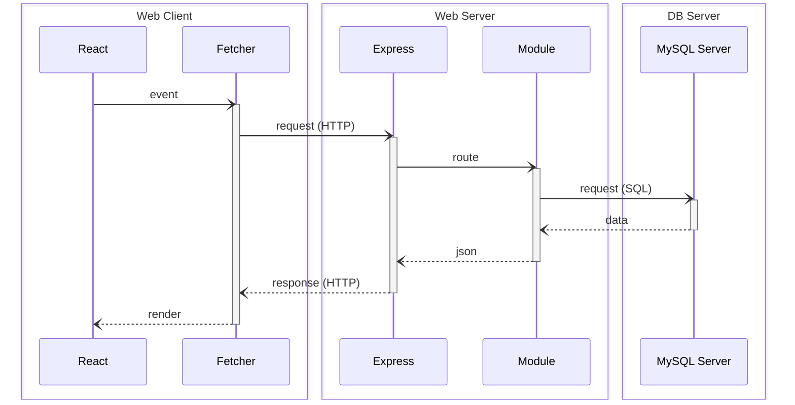

# StartER

Ce projet est un framework pédagogique, suivant une architecture React-Express-MySQL :



Il est pré-configuré avec un ensemble d'outils pour aider des juniors à produire du code de qualité industrielle, tout en restant un outil pédagogique :

- [**Express**](https://expressjs.com/) : Framework minimaliste pour créer des serveurs web et des API avec Node.js.  
- [**React**](https://react.dev/learn) : Bibliothèque JavaScript pour construire des interfaces utilisateur interactives et modulaires.  

Sous le capot (dans l'ordre alphabétique, liste non exhaustive) :

- [**Biome**](https://biomejs.dev/) : Outil tout-en-un pour le linting, le formatage et l'analyse statique de code, conçu pour assurer la qualité et la lisibilité du code de manière performante et moderne.  
- [**Docker**](https://docs.docker.com/) : Plateforme de conteneurisation permettant de standardiser et d'automatiser les environnements de développement et de déploiement, garantissant des configurations reproductibles.  
- [**MySQL**](https://dev.mysql.com/doc/refman/8.4/en/) : Système de gestion de bases de données relationnelles, utilisé pour stocker et interroger les données.  
- [**Pico CSS**](https://picocss.com/) : Kit CSS minimaliste et léger qui donne la priorité à la syntaxe sémantique.  
- [**React Router (Mode Data)**](https://reactrouter.com/home) : Gestionnaire de routage pour les applications React, permettant la création de chemins et de composants dynamiques.  
- [**TypeScript**](https://www.typescriptlang.org/) : Superset de JavaScript ajoutant des types statiques, facilitant la maintenance et réduisant les erreurs.  
- [**Vite**](https://vite.dev/guide/) : Outil de construction rapide et léger pour les applications front-end, avec un serveur de développement ultra-rapide et une optimisation des bundles pour la production.  
- [**Vitest**](https://vitest.dev/guide/) : Framework de test JavaScript.  
- [**Zod**](https://zod.dev/) : Bibliothèque de déclaration et de validation de schéma axée sur TypeScript.  

## Table des matières

- [StartER](#starter)
  - [Table des matières](#table-des-matières)
  - [Installation et utilisation](#installation-et-utilisation)
  - [Les choses à retenir](#les-choses-à-retenir)
    - [Structure des fichiers sources](#structure-des-fichiers-sources)
    - [Commandes de base](#commandes-de-base)
    - [REST cheatsheet](#rest-cheatsheet)
  - [Contribution](#contribution)

## Installation et utilisation

Une documentation complète est disponible dans notre [wiki](https://github.com/rocambille/start-express-react/wiki).

Pour démarrer, référez-vous aux pages :

* [Installation](https://github.com/rocambille/start-express-react/wiki/Installation)
* [Database](https://github.com/rocambille/start-express-react/wiki/Database)
* [Express](https://github.com/rocambille/start-express-react/wiki/Express)
* [React](https://github.com/rocambille/start-express-react/wiki/React)

## Les choses à retenir

### Structure des fichiers sources

```plaintext
my-project/
├── src/
|   ├── database/
│   |   ├── checkConnection.ts
│   |   ├── client.ts
│   |   └── schema.sql
│   ├── express/
│   │   ├── modules/
│   │   │   └── ...
│   │   └── routes.ts
|   ├── react/
│   │   ├── components/
│   │   │   └── ...
│   │   ├── pages/
│   │   │   └── ...
│   │   └── routes.tsx
|   ├── types/
│   │   └── index.d.ts
|   ├── entry-client.tsx
|   └── entry-server.tsx
├── index.html
└── server.ts
```

### Commandes de base

| Commande                                              | Description                                                                 |
|-------------------------------------------------------|-----------------------------------------------------------------------------|
| `docker compose up --build`                           | Build et démarre les services (ajouter `-d` pour démarrer en mode détaché)  |
| `docker compose -f compose.prod.yaml up --build -d`   | Build et démarre en production                                              |
| `docker compose logs -t`                              | Affiche les logs avec les timestamps                                        |
| `docker compose run --build --rm server npm run test` | Exécute les tests                                                           |
| `npm run check`                                       | Contrôle la qualité du code avec Biome (exécuté en pre-commit)              |
| `npm run check-types`                                 | Contrôle la cohérence des types avec TypeScript (exécuté en pre-commit)     |

### REST cheatsheet

| Opération | Méthode | Chemin d'URL    | Corps de la requête | SQL     | Réponse (Succès)                | Réponse (Erreur)                                                        |
|-----------|---------|-----------------|---------------------|---------|---------------------------------|-------------------------------------------------------------------------|
| Browse    | GET     | /api/items      |                     | SELECT  | 200 (OK), liste des items.      |                                                                         |
| Read      | GET     | /api/items/:id  |                     | SELECT  | 200 (OK), un item.              | 404 (Not Found), si id invalide.                                        |
| Add       | POST    | /api/items      | Données de l'item   | INSERT  | 201 (Created), id d'insertion.  | 400 (Bad Request), si corps invalide.                                   |
| Edit      | PUT     | /api/items/:id  | Données de l'item   | UPDATE  | 204 (No Content).               | 400 (Bad Request), si corps invalide. 404 (Not Found), si id invalide.  |
| Destroy   | DELETE  | /api/items/:id  |                     | DELETE  | 204 (No Content).               |                                                                         |

## Contribution

Nous accueillons avec plaisir les contributions ! Veuillez suivre ces étapes pour contribuer :

1. **Forkez** le dépôt.
2. **Clonez** votre fork sur votre machine locale.
3. Créez une nouvelle branche pour votre fonctionnalité ou bug fix (`git switch -c feature/your-feature-name`).
4. Faites un **commit** de vos modifications (`git commit -m 'Add some feature'`).
5. **Pushez** vers votre branche (`git push origin feature/your-feature-name`).
6. Créez une **Pull Request** sur le dépôt principal.

**Guide de Contribution** :

- Assurez-vous que votre code respecte les standards de codage en exécutant `npm run check` avant de pousser vos modifications.
- Ajoutez des tests pour toute nouvelle fonctionnalité ou correction de bug.
- Documentez clairement vos modifications dans la description de la pull request.
