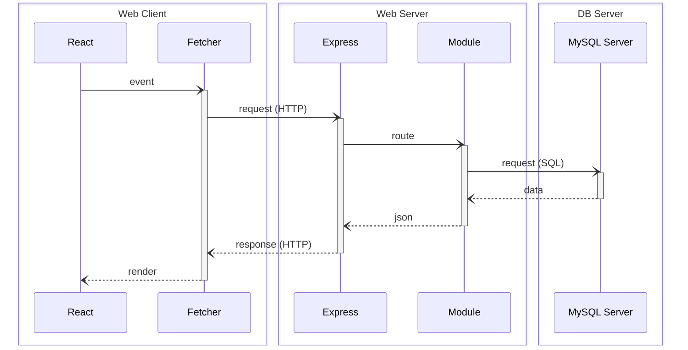

[](https://github.com/rocambille/start-express-react/tags/)
[](https://github.com/rocambille/start-express-react/blob/main/LICENSE.md)
[](https://github.com/rocambille/start-express-react/issues)

<div align="right">

[](./README.en-US.md)
[](./README.md)

</div>

<div align="center">

# StartER – Un starter Express + React full-stack moderne

🔧 **Framework pédagogique** pour créer des applications web en Express + React avec des outils de production intégrés.

⭐️ Si vous trouvez ce projet utile, **laissez une étoile** pour soutenir le projet ! [](https://github.com/rocambille/start-express-react)

[](https://github.com/rocambille/start-express-react/generate)

[](https://github.com/rocambille/start-express-react/wiki)

</div>

## Vue d'ensemble



Le framework est pré-configuré avec un ensemble d'outils pour aider des juniors à produire du code de qualité industrielle, tout en restant un outil pédagogique :

- [**Express**](https://expressjs.com/) : Framework minimaliste pour créer des serveurs web et des API avec Node.js.  
- [**React**](https://react.dev/learn) : Bibliothèque JavaScript pour construire des interfaces utilisateur interactives et modulaires.  

Sous le capot (dans l'ordre alphabétique, liste non exhaustive) :

- [**Biome**](https://biomejs.dev/) : Outil tout-en-un pour le linting, le formatage et l'analyse statique de code, conçu pour assurer la qualité et la lisibilité du code de manière performante et moderne.  
- [**Docker**](https://docs.docker.com/) : Plateforme de conteneurisation permettant de standardiser et d'automatiser les environnements de développement et de déploiement, garantissant des configurations reproductibles.  
- [**MySQL**](https://dev.mysql.com/doc/refman/8.4/en/) : Système de gestion de bases de données relationnelles, utilisé pour stocker et interroger les données.  
- [**Pico CSS**](https://picocss.com/) : Kit CSS minimaliste et léger qui donne la priorité à la syntaxe sémantique.  
- [**React Router (Mode Data)**](https://reactrouter.com/home) : Gestionnaire de routage pour les applications React, permettant la création de chemins et de composants dynamiques.  
- [**TypeScript**](https://www.typescriptlang.org/) : Superset de JavaScript ajoutant des types statiques, facilitant la maintenance et réduisant les erreurs.  
- [**Vite**](https://vite.dev/guide/) : Outil de construction rapide et léger pour les applications front-end, avec un serveur de développement ultra-rapide et une optimisation des bundles pour la production.  
- [**Vitest**](https://vitest.dev/guide/) : Framework de test JavaScript.  
- [**Zod**](https://zod.dev/) : Bibliothèque de déclaration et de validation de schéma axée sur TypeScript.  

## Installation et utilisation

Une documentation complète est disponible dans notre [wiki](https://github.com/rocambille/start-express-react/wiki).

Pour démarrer, référez-vous aux pages :

* [Installation](https://github.com/rocambille/start-express-react/wiki/Installation)
* [Database](https://github.com/rocambille/start-express-react/wiki/Database)
* [Express](https://github.com/rocambille/start-express-react/wiki/Express)
* [React](https://github.com/rocambille/start-express-react/wiki/React)

## Les choses à retenir

### Structure des fichiers sources

```
.
├── .env
├── .env.sample
├── compose.yaml
├── compose.prod.yaml
├── Dockerfile
├── index.html
├── server.ts
└── src
    ├── database
    │   └── schema.sql
    ├── express
    │   ├── routes.ts
    │   └── modules
    │       └── ...
    ├── react
    │   ├── routes.tsx
    │   ├── components
    │   │   └── ...
    │   └── pages
    │       └── ...
    └── types
        └── index.d.ts
```

### Commandes de base

| Commande                                                          | Description                                                                 |
|-------------------------------------------------------------------|-----------------------------------------------------------------------------|
| `docker compose up --build`                                       | Build et démarre les services (ajouter `-d` pour démarrer en mode détaché)  |
| `docker compose -f compose.prod.yaml up --build -d`               | Build et démarre en production                                              |
| `docker compose logs -t`                                          | Affiche les logs avec les timestamps                                        |
| `docker compose run --build --rm server npm run database:sync`    | Synchronise le contenu de la base de données avec `src/database/schema.sql` |
| `docker compose run --build --rm server npm run test`             | Exécute les tests                                                           |
| `docker compose run --build --rm server npm run make:purge`       | Supprime les modules par défaut. Ajoutez `-- --keep-auth` pour conserver les modules user et auth. |
| `npm run biome:check`                                             | Contrôle la qualité du code avec Biome (exécuté en pre-commit)              |
| `npm run types:check`                                             | Contrôle la cohérence des types avec TypeScript (exécuté en pre-commit)     |

### REST cheatsheet

| Opération | Méthode | Chemin d'URL    | Corps de la requête | SQL     | Réponse (Succès)                | Réponse (Erreur)                                                        |
|-----------|---------|-----------------|---------------------|---------|---------------------------------|-------------------------------------------------------------------------|
| Browse    | GET     | /api/items      |                     | SELECT  | 200 (OK), liste des items.      |                                                                         |
| Read      | GET     | /api/items/:id  |                     | SELECT  | 200 (OK), un item.              | 404 (Not Found), si id invalide.                                        |
| Add       | POST    | /api/items      | Données de l'item   | INSERT  | 201 (Created), id d'insertion.  | 400 (Bad Request), si corps invalide.                                   |
| Edit      | PUT     | /api/items/:id  | Données de l'item   | UPDATE  | 204 (No Content).               | 400 (Bad Request), si corps invalide. 404 (Not Found), si id invalide.  |
| Destroy   | DELETE  | /api/items/:id  |                     | DELETE  | 204 (No Content).               |                                                                         |
